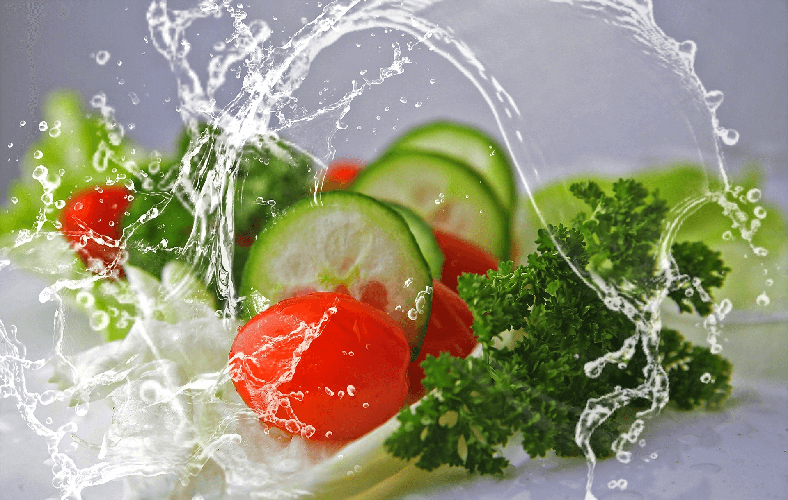

# Food

## [Выбрать идеальный рацион питания](https://skripkaru.github.io/food/)

## About project:
* Сайт о здоровой и вкусной еде
* На сайте вы сможете:
    - Выбрать походящий стиль питания
    - Рассчитать суточную норму калории для разных типов фигур и активностей
    - Выбрать меню на день
    - Отправить свои данные через форму обратной связи
    - Успеть поучавствовать в акции (время до окончания Акции указано в соответствующем разделе)
* Версия для планшетных и мобильных устройств в разработке
 
* Модальное окно вызывается нажатием кнопок обраной связи, при полной прокрутке страницы и через 5 сек после обновления страницы
* Данные из формы отправляются на локальный сервер POST запросом (необходим запуск JSON server)
* Слайдер реализован с эффектом "сдвига" со сменой маркеров и порядковым номером текущей фотографии
* При рассчете калорий данные о последних введенных данных (пол и физ. активность) хранятся в localStorage 
* Карточки меню формируются на основе данных, полученных GET запросом с сервера (реализовани альтернативный способ получения данных, без запуска JSON сервера)

## Used tools
* HTML5 / CSS3
* JavaScript 
* Webpack / npm / git
* JSON server
* Fetch API / Promise / Web API
